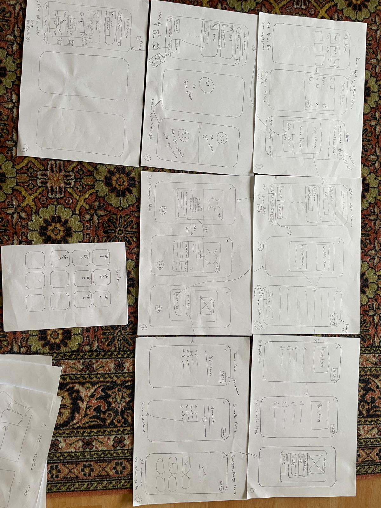
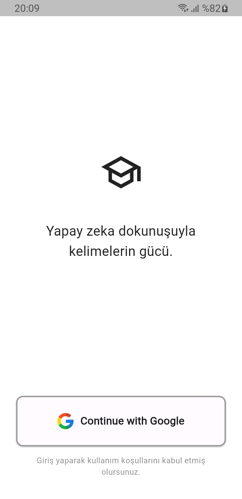
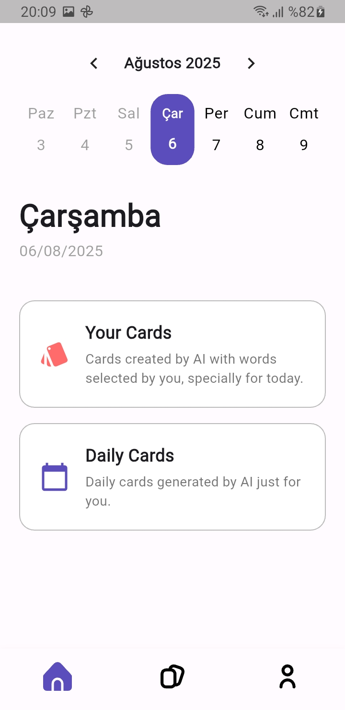
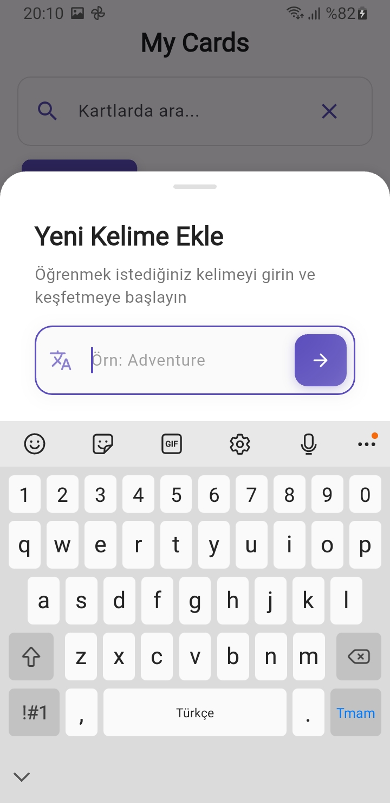
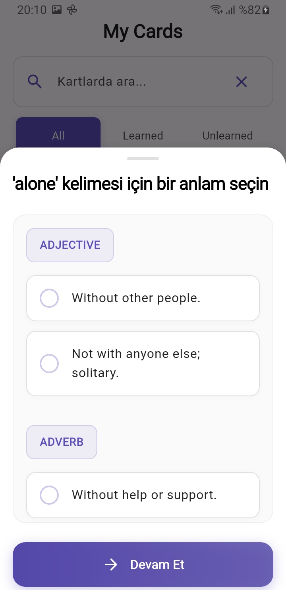
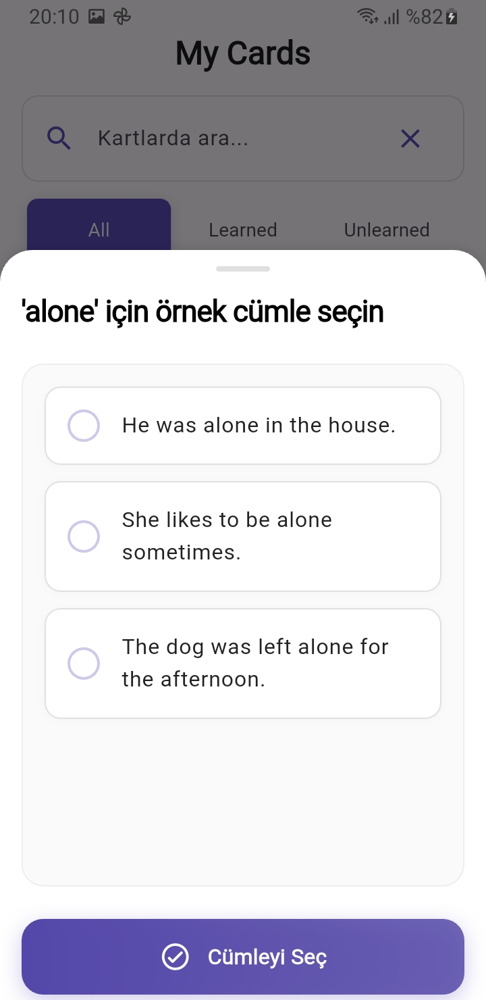
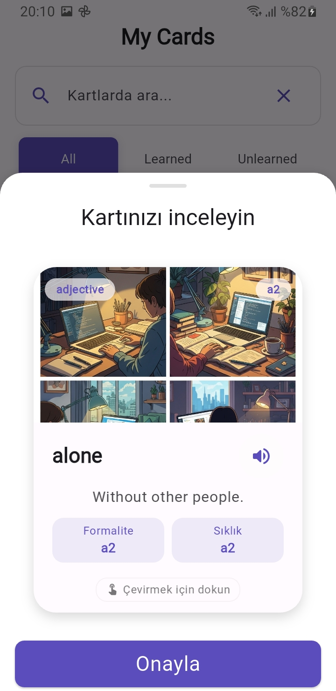
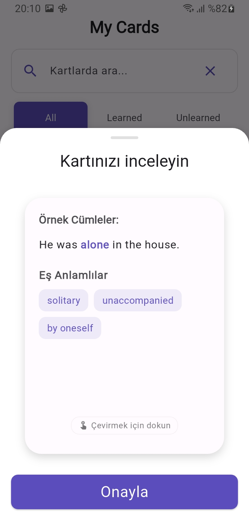

# 📚 LexiLearn AI - Akıllı Sözlük Uygulaması

<div align="center">


_Gemini AI ile güçlendirilmiş, çok dilli akıllı sözlük uygulaması_

</div>

## 🎯 Proje Özeti

LexiLearn AI, Google'ın Gemini AI teknolojisini kullanarak geliştirilmiş yenilikçi bir sözlük uygulamasıdır. Kullanıcıların kelime öğrenme deneyimini kişiselleştirilmiş kartlar ve görsel içeriklerle zenginleştirerek, dil öğrenimini daha etkili ve eğlenceli hale getirir.

### 🎯 Proje Amacı

**Ana Hedef:** Dil öğrenme sürecini modern AI teknolojileri ile birleştirerek, kullanıcıların kelime öğrenme deneyimini kişiselleştirmek ve görsel hafıza teknikleri ile öğrenmeyi hızlandırmak.

**Alt Hedefler:**

- **AI Destekli İçerik Üretimi**: Gemini AI ile kelime tanımları, örnek cümleler ve eş anlamlılar oluşturma
- **Görsel Öğrenme**: AI ile üretilen kelime kartları ve otomatik resim oluşturma
- **Çok Dilli Destek**: Türkçe, İngilizce ve diğer dillerde kelime öğrenme
- **Kişiselleştirilmiş Deneyim**: Kullanıcı seviyesine uygun içerik ve öğrenme yolu


### 💡 Fikir Aşaması

Proje, BTK Akademi Hackathon 2025 kapsamında geliştirilmiştir. Eğitim teknolojileri alanında AI destekli bir çözüm üretmek amacıyla, dil öğrenme sürecini modern teknolojilerle birleştiren bir uygulama tasarlanmıştır.

**Wireframe ve Tasarım Aşaması:**

<!-- Buraya wireframe fotoğrafları eklenecek -->
<div align="center">
  
  
</div>

## ✨ Özellikler

### 🤖 AI Destekli İçerik Üretimi

- **Gemini AI** ile kelime tanımları, örnek cümleler ve eş anlamlılar
- Akıllı kelime türü sınıflandırması (isim, fiil, sıfat vb.)
- Seviyeye uygun açıklamalar (başlangıç, orta, ileri)

### 🎨 Görsel Öğrenme

- AI ile üretilen kelime kartları
- Otomatik resim oluşturma ve boyutlandırma
- Görsel hafıza teknikleri ile öğrenme

### 🌍 Çok Dilli Destek

- Türkçe, İngilizce ve diğer diller
- Dil bazlı kelime arama ve filtreleme
- Kültürel bağlamda öğrenme

### 📱 Mobil Uygulama Özellikleri

- **Flutter** ile geliştirilmiş cross-platform uygulama
- Modern ve kullanıcı dostu arayüz
- Offline çalışma desteği
- Kişiselleştirilmiş öğrenme planları
- İlerleme takibi ve istatistikler

## 🏗️ Teknik Mimari

### Frontend (Flutter Mobile App)

```
lib/
├── presentation/         # UI Katmanı
│   ├── auth/           # Kimlik doğrulama
│   ├── home/           # Ana sayfa
│   ├── my_cards/       # Kartlarım sayfası
│   ├── profile/        # Profil sayfası
│   └── splash/         # Açılış ekranı
├── domain/             # İş Mantığı Katmanı
│   ├── entities/       # Varlıklar
│   ├── repository/     # Repository arayüzleri
│   └── usecase/        # Kullanım durumları
├── data/               # Veri Katmanı
│   ├── model/          # Veri modelleri
│   ├── repository/     # Repository implementasyonları
│   └── sources/        # Veri kaynakları
└── core/               # Çekirdek Bileşenler
    ├── config/         # Konfigürasyon
    ├── localizations/  # Çok dilli destek
    └── theme/          # Tema ayarları
```

### Backend (Supabase Edge Functions)

```
supabase/functions/
├── create-card/          # Kelime kartı oluşturma
├── create-image/         # AI resim üretimi
└── _shared/             # Ortak yardımcı fonksiyonlar
```

### Veritabanı Yapısı

- **PostgreSQL** tabanlı Supabase
- Optimize edilmiş indeksler ve tetikleyiciler
- Çok dilli veri desteği

### AI Entegrasyonu

- **Google Gemini AI API** entegrasyonu
- Dinamik prompt yönetimi
- Maliyet optimizasyonu

## 📱 Ekran Görüntüleri

<div align="center">
  
  
  
  
  
  
  
</div>

### 🎥 Demo Video

https://github.com/user-attachments/assets/dbd548c7-5b14-492a-b7be-0857e5f995a7

## 🚀 Kurulum

### Gereksinimler

- Flutter 3.19.0+
- Node.js 18+
- Supabase CLI
- Google Gemini AI API Key

### Mobil Uygulama Kurulumu

1. **Projeyi klonlayın**

```bash
git clone https://github.com/your-username/lexilearnai.git
cd lexilearnai
```

2. **Bağımlılıkları yükleyin**

```bash
flutter pub get
```

3. **Environment değişkenlerini ayarlayın**

```bash
# lib/core/config/constants.dart dosyasında
const String SUPABASE_URL = 'your_supabase_url';
const String SUPABASE_ANON_KEY = 'your_supabase_anon_key';
const String GEMINI_API_KEY = 'your_gemini_api_key';
```

4. **Uygulamayı çalıştırın**

```bash
flutter run
```

### Backend Kurulumu

1. **Supabase kurulumu**

```bash
npm install -g supabase
supabase login
supabase link --project-ref YOUR_PROJECT_ID
```

2. **Veritabanını kurun**

```bash
supabase db reset
```

3. **Edge Functions'ları deploy edin**

```bash
supabase functions deploy create-card
supabase functions deploy create-image
```

## 📖 Kullanım

### API Endpoints

#### Kelime Kartı Oluşturma

```bash
POST /functions/v1/create-card
Content-Type: application/json

{
  "word": "hello",
}
```

#### Resim Oluşturma

```bash
POST /functions/v1/create-image
Content-Type: application/json

{
  "type_id": "uuid"
}
```

## 🎨 Örnek Çıktılar

### Kelime Kartı

```json
{
  "response": {
    "code": 200,
    "message": "SUCCESS",
    "path": "/create-card"
  },
  "data": {
    "success": true,
    "reason": "from_database",
    "word": "alone",
    "word_id": "0fc4a87f-fc5f-4979-b796-c0c06c6d3c46",
    "types": [
      {
        "id": "ccabe234-e53e-4edd-a692-db336aba7f3a",
        "type": "adjective",
        "ipa": "/əˈləʊn/",
        "definition": [
          "Without other people.",
          "Not with anyone else; solitary."
        ],
        "synonym": ["solitary", "unaccompanied", "by oneself"],
        "sentence": [
          "He was alone in the house.",
          "She likes to be alone sometimes.",
          "The dog was left alone for the afternoon."
        ],
        "level": "a2",
        "photo_description": "A digital illustration of a person sitting alone on a bench in a quiet park, looking at the view."
      },
      {
        "id": "4cee9e7e-47e0-4726-86fb-054dc4204b3c",
        "type": "adverb",
        "ipa": "/əˈləʊn/",
        "definition": [
          "Without help or support.",
          "Without anyone else present or involved."
        ],
        "synonym": ["independently", "single-handedly", "by oneself"],
        "sentence": [
          "She completed the project alone.",
          "He lives alone in a small apartment.",
          "The child was too young to walk home alone."
        ],
        "level": "a2",
        "photo_description": "A digital illustration of a student working alone at a desk with books, a laptop, and a lamp."
      }
    ]
  }
}
```

## 🔮 Gelecek Planları

Hackathon süresinde karşılaştığımız teknik zorluklar ve yetiştiremediğimiz özellikler:

### ⚠️ Teknik Zorluklar

- **Gemini 2.0 Flash Preview Image Generation Kısıtlaması**: Avrupa'da kullanılamadığı için görsel üretim özelliği etkilendi bundan dolayıda bazı özellikler yetişmedi.
- **API Geçiş Süreci**: Gemini 2.0'dan Imagen 4'e geçiş sırasında teknik uyumluluk sorunları yaşandı.

### 🚧 Yetiştirilemeyen Özellikler

- [ ] **Profil Ekranı**: Kullanıcı profil yönetimi ve ayarları
- [ ] **Planlama Ekranı**: Çalışma planı oluşturma ve takip
- [ ] **Kart Kaydetme**: API kısıtlamaları nedeniyle tamamlanamadı
- [ ] **İlerleme Takibi**: Kullanıcı öğrenme istatistikleri
- [ ] **Offline Mod**: Çevrimdışı çalışma desteği

### 📚 Gelecekte Implemente Edilecek Özellikler

### 📚 Öğrenme Özellikleri

- [ ] Akıllı Tekrar sistemi
- [ ] Kelime quiz'leri ve testler
- [ ] Kelime oyunları (crossword, word search)
- [ ] Planlanan kelimelerin içinde bulunduğu okuma metni oluşturma

### 🤝 Sosyal Özellikler

- [ ] Arkadaş ekleme ve kelime paylaşımı
- [ ] Liderlik tablosu
- [ ] Kelime listesi paylaşımı
- [ ] Grup çalışma odaları

### 🌐 Platform Genişletme

- [ ] Web uygulaması

## 👥 Takım

### 🧑‍💻 Geliştiriciler

- **Abdulsamet Genç** - Mobil Uygulama Geliştirici
- **Fahri Genç** - Backend Geliştirici

### 📋 İş Paylaşımı

| Görev                              | Sorumlu            | Açıklama                                               |
| ---------------------------------- | ------------------ | ------------------------------------------------------ |
| **Fikir Aşaması**                  | Abdulsamet & Fahri | Birlikte proje konsepti ve hedefler                    |
| **Tasarım Aşaması**                | Abdulsamet         | Wireframe ve UI/UX tasarımı                            |
| **Mobil Uygulama**                 | Abdulsamet         | Flutter ile cross-platform geliştirme                  |
| **Backend API ve AI Entegrasyonu** | Fahri              | Supabase Edge Functions, veritabanı ve AI entegrasyonu |
| **Prompt Tasarımı**                | Fahri              | AI prompt'ları ve optimizasyonu                        |
| **Test ve Optimizasyon**           | Abdulsamet & Fahri | Birlikte test ve iyileştirmeler                        |

### 🛠️ Teknolojiler

- **Frontend**: Flutter, Dart, Bloc/Cubit
- **Backend**: Supabase, TypeScript, PostgreSQL
- **AI**: Google Gemini AI, Imagen API (Google Api)
- **Araçlar**: Git, VS Code, HTTPie, Docker

## 🏆 BTK Akademi Hackathon 2025

Bu proje, BTK Akademi'nin düzenlediği 2025 Hackathon'unda geliştirilmiştir. Eğitim teknolojileri alanında yenilikçi çözümler üretmek amacıyla tasarlanmıştır.

### 🎯 Hackathon Hedefleri

- ✅ AI destekli kelime kartı oluşturma
- ✅ Görsel içerik üretimi
- ✅ Mobil uygulama geliştirme
- ✅ Çok dilli destek
- ✅ Modern UI/UX tasarımı
- ✅ Kullanıcı kimlik doğrulama
- ✅ Kart görüntüleme ve inceleme
- ❌ Kart kaydetme
- ❌ Profil ekranı
- ❌ Planlama ekranı

---

<div align="center">

**LexiLearn AI** - Yapay zeka dokunuşuyla kelimelerin gücü.

</div>
